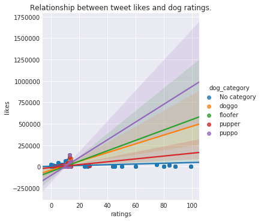
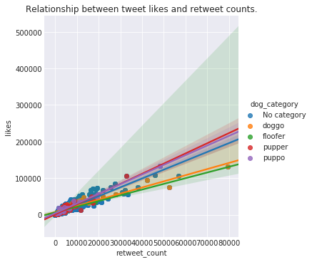
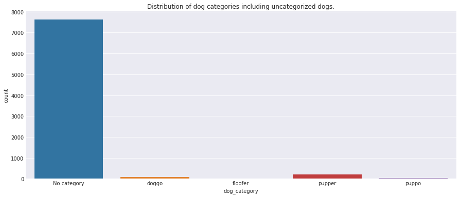
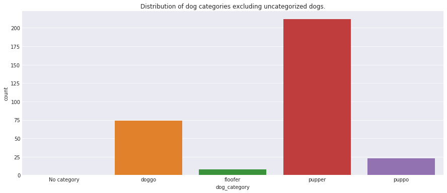

## Report: act_report

## WeRateDogs

### Introduction

This project involved the wrangling, analyzing, and visualizing of datasets associated with the tweet archive of Twitter user [@dog_rates](https://twitter.com/dog_rates), also known as [WeRateDogs](https://en.wikipedia.org/wiki/WeRateDogs). From the documentation given, WeRateDogs is a Twitter account that rates people's dogs with a humorous comment about the dog. These ratings almost always have a denominator of 10 with over 4 million followers and ample international media coverage. The datasets used in this project was gathered from various sources, assessed, cleaned, and insights was drawn from them.

The insights gotten from the data assessed, gathered and cleaned were in three folds viz:

1. No relationship was found between ratings and likes or retweet counts which gives a strong cause for further investigation as one would have expected an agreement with the given rating resulting in likes.

2. There was also a strong relationship between tweet likes and retweet counts indicating a likelihood of tweets liked being retweeted.

3. An overwhelming 96% of dogs in this version of cleaned dataset were not having categories, however, the greater percentage(66.88%), of those categorized were "puppers".

On the overall, more processes need to be carried out to bring definitive insights out of the available data.

### Conclusion

The data wrangling process was carried out successfully for the relevant data. Different quality and tidiness issues were highlighted, cleaned, and tested using the relevant framework.
Insights were then drawn from the cleaned data which coupled with some drawn up visualizations showed some pretty interesting details. However, it should be noted that the datasets in uestion still had some issues to be corrected, which coupled with appropriate domain knowledge should result in even more impressive and accurate insights.
